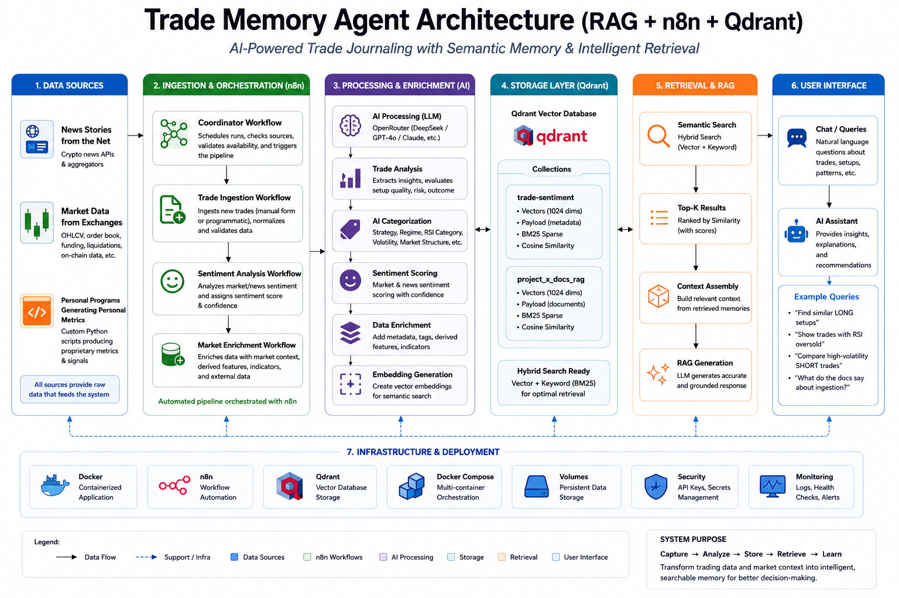

# 🚀 Project-X Crypto Trade Retrieval System

## 📖 Overzicht

Project-X is een lokaal AI-assisted retrieval platform ontworpen voor het analyseren, vergelijken en contextualiseren van historische cryptocurrency trades.

Het systeem combineert:

- 🔄 Workflow automatisatie  
- 🧠 Lokale AI verwerking  
- 🔍 Vector embeddings  
- 📊 Semantische retrieval  

om historische trade setups sneller, consistenter en schaalbaarder analyseerbaar te maken.

---
## 📁 Repository Structuur

```text
VOORNAAM_ACHTERNAAM_Eindproject/
│
├── README.md
│
├── workflows/
│   ├── Project-X Coordinator Workflow.json
│   ├── Project-X Trade Ingestion Workflow.json
│   ├── Project-X Market Feature Extraction.json
│   ├── Project-X News Sentiment Extraction.json
│   ├── Project-X Trade Retrieval Evaluation.json
│   └── Project-X Trade Close Update.json
│
├── screenshots/
│   ├── docker/
│   ├── n8n/
│   ├── lm-studio/
│   └── demo-screenshots/
│
├── documentation/
│   ├── architecture-diagram/
│   └── dpia/
│
├── database/
│   └── market_data_sample.sql
│
├── business-case/
│   ├── roi-analysis.xlsx
│   └── leidinggevende-1pager.pdf
│
├── video/
│   └── Project-X-Videdemo.mp4
│
└── Trade Input.html
```


# ⚙️ Setup (Docker Desktop GUI)

## 📋 Stap 1: Vereisten

Voor het uitvoeren van het systeem zijn volgende componenten vereist:

- 🐳 Docker Desktop geïnstalleerd
- 🧠 LM Studio geïnstalleerd
- 📂 GitHub repository gedownload
- 💻 Windows 10/11 aanbevolen

---

# 🐳 Stap 2: Containers starten

## 🔄 n8n

1. Open Docker Desktop → `Images`
2. Zoek: `n8nio/n8n`
3. Klik `Pull`
4. Klik `Run`

### Configuratie

| Setting | Waarde |
|---|---|
| Name | `x-n8n` |
| Port | `5678:5678` |
| Volume | `x-n8n-data` |

5. Start container
6. Controleer:
   http://localhost:5678

---

## 🔎 Qdrant

1. Open Docker Desktop → `Images`
2. Zoek: `qdrant/qdrant`
3. Klik `Pull`
4. Klik `Run`

### Configuratie

| Setting | Waarde |
|---|---|
| Name | `x-qdrant` |
| Port | `6333:6333` |
| Volume | `x-qdrant-data` |

5. Start container
6. Controleer:
   http://localhost:6333/dashboard

---

## 🗄️ PostgreSQL

1. Open Docker Desktop → `Images`
2. Zoek: `postgres`
3. Klik `Pull`
4. Klik `Run`

### Configuratie

| Setting | Waarde |
|---|---|
| Name | `x-postgres` |
| Port | `5432:5432` |

### Environment Variables

```env
POSTGRES_USER=postgres
POSTGRES_PASSWORD=postgres
```

### Volume

```text
x-postgres-data
```

5. Start container

---

# 🧠 Stap 3: LM Studio Configuratie

1. Open LM Studio

2. Download / laad de volgende modellen:

| Model | Functie |
|---|---|
| `text-embedding-bge-m3` | Embedding generatie & vector search |
| `llama-3.2-3b-instruct` | Lokale AI-analyse & evaluatie-output |

3. Start de LM Studio Local Server

4. Controleer:
   http://localhost:1234

---

# 🗄️ Stap 4: Database Import

1. Open PostgreSQL of pgAdmin
2. Maak database:
   `Final-Project-Raoul`

3. Importeer:

```text
/database/market_data_sample.sql
```

4. Controleer of volgende tabellen bestaan:

- `coin_metrics`
- `coins`
- `crypto_prices`

---

# 🔄 Stap 5: Workflows importeren

1. Open n8n
2. Klik `Import Workflow`
3. Selecteer de JSON-bestanden uit `/workflows/`
4. Importeer alle workflows
5. Controleer of alle nodes correct geladen zijn
6. Stel credentials en connecties in indien nodig

---

# 🧪 Stap 6: Testen

## ✅ Test 1 — Workflow Trigger

1. Open de Coordinator Workflow
2. Activeer de webhook
3. Open `/Trade Input.html`
4. Vul een test trade in
5. Klik `Submit Trade`
6. Controleer succesvolle workflow execution in n8n

---

## 🧠 Test 2 — Embedding Generatie

1. Controleer of LM Studio actief is
2. Run de Trade Ingestion Workflow
3. Controleer succesvolle embedding generatie

---

## 🔍 Test 3 — Qdrant Storage

1. Open Qdrant Dashboard
2. Controleer collections
3. Controleer nieuwe vector insertions

---

## 📊 Test 4 — Retrieval Workflow

1. Open de Retrieval Workflow
2. Voer retrieval query uit
3. Controleer retrieval resultaten en similarity scores

---

# 🏗️ Architectuur



Project-X gebruikt een lokaal retrieval-gebaseerd AI-platform waarbij trades eerst gevalideerd en verrijkt worden via n8n workflows. Daarna worden embeddings lokaal gegenereerd via LM Studio en opgeslagen in Qdrant.

De retrieval workflows gebruiken semantische vector search en metadata filtering om vergelijkbare historische trades terug te vinden.

## 🔧 Belangrijkste componenten

- 🔄 n8n → workflow orchestratie
- 🧠 LM Studio → lokale embeddings & AI verwerking
- 🗄️ PostgreSQL → marktdata opslag
- 🔎 Qdrant → vector retrieval database
- 🐳 Docker → lokale infrastructuur

---


## 🎥 Demo Video

De demo-video is meegeleverd in deze repository:

📎 `video/Project-X-Videdemo.mp4`

Deze video toont de werking van het systeem, inclusief de belangrijkste workflows, validatie, embedding generation, Qdrant opslag en retrieval-resultaten.

---
## Reflectie

Tijdens de ontwikkeling van Project-X werd duidelijk dat het bouwen van een AI-systeem veel verder gaat dan enkel het integreren van een Large Language Model. De grootste uitdaging lag niet in het genereren van antwoorden, maar in het ontwerpen van betrouwbare datastromen, consistente gegevensstructuren en een reproduceerbaar retrievalproces.

Een belangrijke les was het belang van gegevenskwaliteit. Kleine verschillen in de manier waarop trade-context werd opgeslagen hadden een grote invloed op de kwaliteit van de retrieval-resultaten. Daarom werd gekozen voor een gestandaardiseerde "Trade Context Snapshot" waarin numerieke marktgegevens worden omgezet naar betekenisvolle categorieën zoals trendrichting, volatiliteit en RSI-status.

Daarnaast werd duidelijk hoe belangrijk evaluatie is binnen een retrieval-systeem. Het implementeren van afzonderlijke evaluatiemetrics zoals Relevance, Faithfulness, Context Precision, Context Recall en Answer Relevance gaf veel meer inzicht in de werkelijke prestaties van het systeem dan enkel het bekijken van retrieval-scores.

Tot slot heeft dit project het belang aangetoond van privacy-by-design. Door persoonsgegevens volledig te scheiden van embeddings en retrieval-data kon een GDPR-conforme architectuur worden gerealiseerd zonder de functionaliteit van het systeem te beperken.

---
## Toekomstige Verbeteringen

### Verdere Verhoging van Betrouwbaarheid en Kwaliteit

Project-X is ontwikkeld als een volledig werkende proof-of-concept en referentiearchitectuur voor AI-gestuurde trade retrieval. Het systeem demonstreert succesvol de volledige workflow van data-ingestie, verrijking, sentimentanalyse, vectoropslag, retrieval en evaluatie.

De focus van dit eindproject lag in de eerste plaats op het ontwerpen en implementeren van een werkende end-to-end architectuur. Hoewel het systeem functioneel is, zijn er nog veel mogelijkheden om de kwaliteit, nauwkeurigheid en betrouwbaarheid van de retrieval-resultaten verder te verhogen. Dit is een normaal onderdeel van de levenscyclus van AI-systemen, waarbij prestaties iteratief verbeteren naarmate meer data, evaluaties en optimalisaties beschikbaar komen.

### Verbetering van Retrieval Kwaliteit

Een eerste belangrijke verbetering is het verder optimaliseren van de retrieval-resultaten. Momenteel maakt het systeem gebruik van dense vector retrieval op basis van embeddings. Toekomstige versies kunnen worden uitgebreid met hybride retrieval-technieken waarbij vector search wordt gecombineerd met keyword- of sparse retrieval. Hierdoor kunnen zeer specifieke zoekopdrachten nog nauwkeuriger worden behandeld.

Daarnaast kan de kwaliteit van de resultaten verder worden verhoogd door een grotere historische dataset op te bouwen. Naarmate meer trades worden opgeslagen, krijgt het systeem meer relevante voorbeelden om mee te vergelijken, wat de kwaliteit van de retrieval-resultaten ten goede komt.

### Verbetering van Sentiment Analyse

De huidige sentimentanalyse is gebaseerd op nieuwsartikelen en gestructureerde evaluatiecriteria. In toekomstige versies kan dit worden uitgebreid met extra databronnen zoals social media, marktrapporten en gespecialiseerde crypto-nieuwsplatformen.

Ook kan bronbetrouwbaarheid worden meegenomen in de analyse zodat sentiment afkomstig van kwalitatieve bronnen een grotere invloed krijgt dan sentiment afkomstig van minder betrouwbare bronnen.

### Verbetering van Evaluatie en Monitoring

Momenteel beschikt Project-X over een evaluatieworkflow met verschillende kwaliteitsmetingen zoals Relevance, Faithfulness, Context Precision, Context Recall en Answer Relevance.

Een volgende stap is het volledig automatiseren van kwaliteitsmonitoring zodat prestaties over langere periodes kunnen worden opgevolgd. Hierdoor kunnen trends, degradatie van retrieval-kwaliteit en verbeteringen objectief worden gemeten.

### Verbetering van Schaalbaarheid

Hoewel het huidige systeem ontworpen is voor lokaal gebruik, kan de architectuur verder worden uitgebreid voor grotere datasets en hogere volumes.

Mogelijke uitbreidingen zijn ondersteuning voor meerdere gebruikers, API-gebaseerde toegang, geautomatiseerde verwerking van grotere hoeveelheden data en schaalbare deployment-architecturen waarbij verschillende componenten onafhankelijk van elkaar kunnen worden opgeschaald.

### Uitbreiding van de Kennisbank

Naast historische trades en sentimentdata kan de kennisbank verder worden uitgebreid met aanvullende documentatie zoals marktanalyses, onderzoeksrapporten, trading-handleidingen en technische documentatie.

Hierdoor kan het systeem niet alleen gelijkaardige trades terugvinden, maar ook extra context aanbieden die kan bijdragen aan betere geïnformeerde beslissingen.

### Conclusie

Het huidige Project-X systeem bewijst dat de volledige architectuur technisch werkt en alle kerncomponenten succesvol met elkaar integreert. De belangrijkste toekomstige focus ligt daarom niet op het toevoegen van ontbrekende functionaliteit, maar op het verder verbeteren van de kwaliteit, betrouwbaarheid en prestaties van de bestaande componenten. Hierdoor kan het systeem stap voor stap evolueren van een werkende proof-of-concept naar een steeds robuustere en intelligentere retrieval-oplossing.
